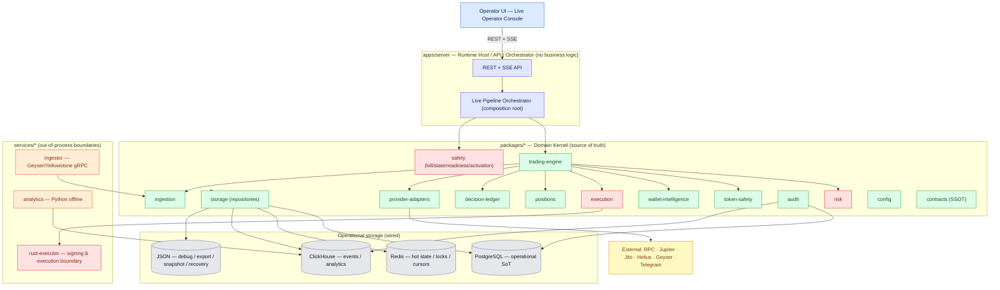
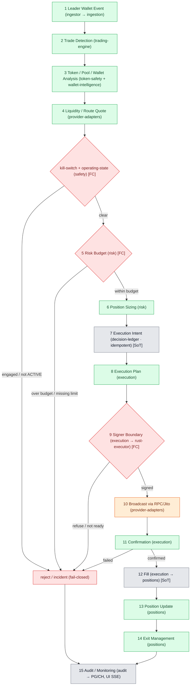
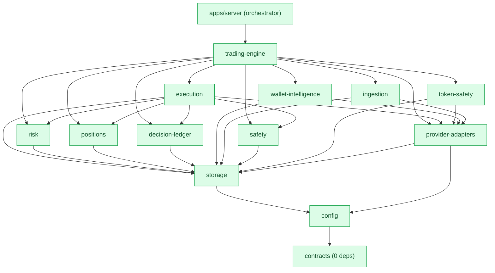

# ADR-0001 — Soltrade Live-First Runtime Unification

- **Status:** Proposed (executive architecture decision)
- **Date:** 2026-06-15
- **Owner:** single operator
- **Supersedes / extends:** `docs/RESTRUCTURE_PLAN.md`
- **Companion:** `C4-Documentation/` (verified current-state docs + diagrams)
- **Green guard (non-negotiable each step):** `node --test` stays green; new path lands behind a flag; old path stays until parity is proven.

> القرار باختصار: نُوحّد المنتج حول **Live trading كمسار أصلي (Live-First)**. تصبح `packages/*` هي **Domain Kernel** ومصدر الحقيقة لمنطق التداول، ويتحوّل `apps/server` إلى **Runtime Host / API / Orchestrator** نحيف بلا منطق أعمال. تصبح **PostgreSQL** مصدر الحقيقة التشغيلي، **ClickHouse** مخزن الأحداث/التحليلات، **Redis** طبقة الحالة الساخنة/الأقفال/الحدود. يبقى **JSON** لِـ debug/export/snapshot/recovery فقط. يصبح **Rust** حدّ التوقيع والتنفيذ الرسمي. يتحوّل **Paper** إلى **Diagnostic Adapter** فقط. **كل بوابات الأمان تبقى وتُرقّى** (Live-Native، وليس Live مفتوح).

---

## 1) تشخيص المشكلة المعمارية الحالية (مؤكَّد من الكود)

| العَرَض | الدليل من المستودع |
|--------|--------------------|
| **عالمان منفصلان** | `apps/server/src/**` يستورد فقط `./*` و `node:*` — **صفر استيراد من `packages/*`**. الحزم تستورد بعضها عبر مسارات نسبية (`../../ssot-types/src/...`) لا عبر `@soltrade/*`. |
| **منطق مكرَّر** | منطق المخاطر/القرار/الـ intent/المحفظة موجود **مرّتين**: `apps/server/src/engine/{risk-gates,ev-gate,sizing,orders,exit-rules,paper-portfolio}.mjs` و `packages/{risk-gates,decision-engine,intent-ledger,position-lifecycle,paper-portfolio,...}`. |
| **حِزم معزولة** | **18 من 52 حزمة** (كلها `*-foundations` غالبًا) بلا أي حافة استيراد داخلة أو خارجة — مُصمَّمة ومختبَرة لكن غير مُركَّبة. |
| **تخزين هشّ** | المصدر التشغيلي الحقيقي = **13 ملف JSON** في `data/` (`config, paper-portfolio, live-portfolio, intent-ledger, orders, operating-state, kill-switch, history, engine-events, latency-samples, audit, tracked-wallets`) + `vault.enc`. **لا اتصال** بـ Postgres/ClickHouse/Redis في `apps/server` (grep = صفر). |
| **بنية تحتية معطّلة الوصل** | `infra/docker/compose.yaml` يشغّل المخازن الثلاثة، و`migrations/postgres/000{1,2,3}.sql` + `migrations/clickhouse/0001` موجودة، لكن `packages/data` (المُسجِّل النوعي) غير موصول. |
| **Paper ثقيل معماريًا** | `paper-engine.mjs` هو الـ supervisor الفعلي للـ pipeline، و`live-executor.mjs` مسار جانبي خلف بوابة تفعيل لا تُفتَح (`can_send`/`seam_ready` ثوابت `false`). |
| **نداءات المزوّدين متناثرة** | `engine/{jupiter-client,rpc-client,jito-tip-tx,helius-das,hot-executor-client,provider-health}.mjs` متفرّقة داخل الخادم دون طبقة adapter موحّدة. |
| **حدّ Rust غير رسمي** | `services/hot-executor` (Rust، توقيع مقفل على fee-payer) يُستدعى عبر `hot-executor-client.mjs` كـ child process اختياري خلف علم — وليس حدًّا رسميًا للتنفيذ. |

**الخلاصة:** المنتج العامل اليوم هو نظام **paper-heavy، self-contained، JSON-based**، بينما الاستثمار الهندسي الأكبر (الحزم + المهاجرات + Rust) **غير موصول** بالمسار العامل.

---

## 2) لماذا الازدواج = Drift Risk + Double Maintenance

1. **انجراف المنطق (drift):** كل قاعدة مخاطر/قرار مكتوبة في موضعين تتطوّر في موضع واحد فقط مع الوقت. مثال واقعي مُلاحَظ: ترتيب سلسلة القرار في `engine/paper-engine.mjs` (sizing → hard-risk → token-safety → EV → filters) **يخالف** الترتيب الموصوف في حزم/وثائق المجال. هذا انجراف فعلي قائم الآن.
2. **مصدر حقيقة مزدوج:** أيّ تعديل على "ماهية الحد الصلب" يجب أن يُكرَّر في `engine/risk-gates.mjs` و`packages/risk-gates` — ونسيان أحدهما يخلق فجوة أمان صامتة.
3. **اختبارات تكذب على نفسها:** اختبارات الحزم خضراء بينما الكود العامل لا يستعملها → "تغطية" لا تحمي المسار الإنتاجي.
4. **سطح ميّت:** 18 حزمة معزولة + مهاجرات + مخازن غير موصولة = صيانة وتعقيد بلا قيمة تشغيلية، وإيهام بالاكتمال.
5. **كلفة إدراكية:** أي مطوّر جديد يجب أن يفهم أيّ "نسخة" هي الحقيقة، وهذا يبطئ كل تغيير.

**المبدأ المصحِّح:** *مصدر حقيقة واحد للمنطق* → الحزم. *موضع تركيب واحد* → الخادم. *اتجاه تبعية واحد* → من الخادم إلى الحزم، أبدًا العكس.

---

## 3) العمارة الهدف (Target — Live-First)



**القواعد الحاكمة:**
- **Live-First:** المسار الافتراضي في الكود والـ API والواجهة هو live runtime. Paper ليس مسارًا موازيًا بل **محقِّن تشخيصي** (§6).
- **اتجاه تبعية واحد:** `apps/server → packages/*`، و`packages` لا تستورد `apps` أبدًا. `contracts` بلا تبعيات. **لا دورات.**
- **مصدر حقيقة واحد:** المنطق في الحزم؛ الخادم يُركّب فقط.
- **الأمان Live-Native:** كل البوابات تبقى وتُرقّى (§11).

---

## 4) الدور النهائي لكل جزء

| الجزء | الدور النهائي | يملك / لا يملك |
|------|---------------|----------------|
| **`apps/server`** | Runtime Host + API + **Orchestrator** (composition root): يربط الحِزم، يدير دورة حياة العملية، يعرض REST/SSE، يطبّق anti-DNS-rebinding. **لا منطق تداول داخله.** | يملك: التركيب، النقل (HTTP)، التشغيل. لا يملك: قواعد المخاطر/القرار/التنفيذ. |
| **`packages/*`** | **Domain Kernel** — مصدر الحقيقة لكل منطق: detection, risk, decision, execution, positions, safety, ingestion, storage. | يملك: كل قرارات المجال + عقوده. لا يملك: HTTP، عملية التشغيل، الأسرار الخام. |
| **`services/rust-executor`** | **Signing & Execution Boundary** الرسمي: توقيع ed25519 مقفل على fee-payer + بناء طلبات RPC/Jito. يصبح المسار الافتراضي للتوقيع، مع fallback in-process موثّق. | يملك: التوقيع الحتمي. لا يملك: قرار التنفيذ (يأتيه من execution). |
| **`services/ingestor`** | مصدر أحداث القادة out-of-process عبر Geyser/Yellowstone gRPC (مع WS fallback)؛ ينشر إلى `packages/ingestion` عبر Redis stream (الهدف) أو seam داخلي (انتقالي). | يملك: النقل من السلسلة. لا يملك: منطق الكشف. |
| **`services/analytics`** | تحليلات offline (Python) فوق **ClickHouse**: تقييم القادة، backtesting، PnL. Advisory فقط. | يملك: التحليلات الباردة. لا يملك: كتابة الـ ledger أو حجب المسار الساخن. |
| **PostgreSQL** | **Operational Source of Truth**: positions, intents, fills, decisions, config versions, leader registry, audit (append-only). | المصدر الحاكم للحالة الدائمة. |
| **ClickHouse** | **Event / Analytics Store**: stream events, signals, market snapshots, broadcast attempts, confirmations, metrics. | تاريخ غير قابل للتعديل + تحليلات. |
| **Redis** | **Hot-State Layer**: open positions cache, idempotency locks, rate-limits, stream cursors, quote/fee TTL cache, readiness flags. | حالة سريعة قابلة لإعادة البناء (ليست SoT). |
| **JSON** | **debug / export / snapshot / emergency recovery فقط.** لم يعد المصدر التشغيلي. | لقطات واستيراد/تصدير. |
| **Operator UI** | **Live Operator Console**: مراقبة وتحكّم live (positions, intents, risk budgets, kill-switch, readiness, activation, audit) + لوحة تشخيص (نتائج Diagnostic). | واجهة تشغيل live؛ لا منطق ولا أسرار. |

---

## 5) Live Runtime Pipeline (المسار الأساسي)



كل مرحلة تملكها حزمة واحدة (العمود بين قوسين). البوابات (`◇` حمراء) **fail-closed**: أي شك/نقص/تجاوز ⇒ رفض + Incident + Audit، لا تمرير صامت.

---

## 6) Paper → DiagnosticExecutionAdapter (فقط)

Paper لم يعد محرّك تداول موازيًا. يصبح **`DiagnosticExecutionAdapter`** داخل `packages/execution` — أداة فحص جاهزية read-only لا تفتح positions ولا تكتب ledger. ينفّذ نفس المراحل حتى قبل البثّ، ويُرجع تقريرًا:

| الوظيفة | المصدر | يتحقق من |
|--------|--------|----------|
| RPC check | provider-adapters | اتصال/تأخّر RPC |
| Jupiter quote check | provider-adapters | توفّر تسعيرة |
| Route availability | provider-adapters | وجود مسار قابل للتنفيذ |
| Simulation | provider-adapters (RPC simulate) | نجاح محاكاة المعاملة |
| Priority fee estimate | provider-adapters | تقدير الرسوم/التيب |
| Token sellability | token-safety | قابلية البيع (anti-honeypot) |
| Provider health | provider-adapters + safety | صحة المزوّدين |
| **Live readiness result** | safety (`readiness` + `activation`) | تجميع نهائي: جاهز/غير جاهز + قائمة الموانع |

المخرَج = `DiagnosticRun` + `SimulationResult` + `ConnectivityCheck` (ephemeral / ClickHouse history). يخدم زر "Pre-flight" في الـ UI قبل التفعيل الحقيقي.

---

## 7) Package Layout النهائي (Domain Kernel)

> الأساس قائمتك (12) + إضافتان ضروريتان للأمان والبثّ: **`safety`** و **`ingestion`**. `contracts` يبتلع `ssot-types`؛ `storage` يحلّ محل `data`.

```
packages/
├── contracts/          # SSOT: types, enums, DTOs, domain events, error codes  (zero deps)
├── config/             # schema + validation                                    (→ contracts)
├── storage/            # repositories + adapters: Postgres · Redis · ClickHouse · JSON (→ contracts, config)
├── provider-adapters/  # Jupiter · RPC · Jito · Helius · Geyser + health (موحّد)  (→ contracts, config, storage)
├── ingestion/          # leader-event stream: normalize · dedupe · cursors       (→ contracts, provider-adapters, storage)
├── token-safety/       # anti-rug · sellability · market filters                 (→ contracts, provider-adapters)
├── wallet-intelligence/# leader/wallet/token scoring · registry                  (→ contracts, storage, provider-adapters)
├── risk/               # hard-risk · EV · risk budgets · sizing                  (→ contracts, config, storage)
├── decision-ledger/    # idempotent intents + decision trace                     (→ contracts, storage)
├── positions/          # position lifecycle · exits · portfolio · profit-sweep   (→ contracts, storage)
├── execution/          # intents→plans→signer boundary→broadcast + DiagnosticAdapter (→ contracts, risk, decision-ledger, positions, provider-adapters, safety, storage)
├── safety/             # kill-switch · operating-state · readiness · activation · signer-permissions (→ contracts, config, storage)
├── trading-engine/     # detection · signals · decision · live-pipeline policy   (→ نواة الأعلى: risk, token-safety, wallet-intelligence, execution, positions, decision-ledger, provider-adapters, safety, ingestion)
└── audit/              # audit trail (append-only) + metrics/observability       (→ contracts, storage)
```

---

## 8) Data Model (Live-First) + ملكية البيانات

| الكيان | الحزمة المالكة | المخزن الحاكم (SoT) | مخازن مساندة |
|-------|----------------|---------------------|---------------|
| **LeaderWallet** | wallet-intelligence | PostgreSQL | Redis (hot set) |
| **LeaderTrade** | ingestion | ClickHouse (event) | Redis (recent) |
| **DetectedSignal** | trading-engine | ClickHouse | — |
| **TokenCandidate** | token-safety | Redis (hot, TTL) | ClickHouse (history) |
| **MarketSnapshot** | provider-adapters | ClickHouse | Redis (cache TTL) |
| **RouteQuote** | provider-adapters | Redis (short TTL) | ClickHouse (sampled) |
| **RiskBudget** | risk | Redis (live counters) | PostgreSQL (limits/config) |
| **Decision** | trading-engine / decision-ledger | PostgreSQL | ClickHouse (trace) |
| **ExecutionIntent** | decision-ledger | **PostgreSQL** (idempotency SoT) | Redis (lock) |
| **ExecutionPlan** | execution | PostgreSQL | — |
| **SignedTransaction** | execution / rust-executor | **لا يُخزَّن خامًا** (ephemeral) | PostgreSQL (sig ref فقط) |
| **BroadcastAttempt** | execution | PostgreSQL | ClickHouse |
| **Confirmation** | execution | PostgreSQL | ClickHouse |
| **Fill** | execution → positions | **PostgreSQL** | ClickHouse |
| **Position** | positions | **PostgreSQL** | Redis (open positions) |
| **ExitPlan** | positions | PostgreSQL | Redis |
| **Incident** | safety / audit | PostgreSQL | ClickHouse |
| **AuditEvent** | audit | **PostgreSQL (append-only)** | ClickHouse (mirror) |
| **DiagnosticRun** | execution (diagnostic) | ClickHouse (history) | JSON/Redis (ephemeral) |
| **SimulationResult** | execution (diagnostic) | ClickHouse | ephemeral |
| **ConnectivityCheck** | provider-adapters / safety | Redis (TTL) | ClickHouse |

**قاعدة الملكية:** كيان واحد ⇐ حزمة واحدة تملك كتابته ⇐ مخزن SoT واحد. باقي المخازن نسخ مشتقّة قابلة لإعادة البناء. **الأسرار** (مفاتيح التوقيع) تبقى في الـ vault المشفّر، لا في PG/CH/Redis/JSON.

---

## 9) Migration Strategy (10 مراحل عملية)

> كل مرحلة: تهبط خلف علم، تبقي المسار القديم حتى إثبات التكافؤ، و**`node --test` يبقى أخضر** قبل الـ commit. النمط: *Strangler Fig* — نلفّ القديم ونستبدله تدريجيًا.

| Phase | الهدف | خطوات ملموسة | Definition of Done |
|------|------|---------------|--------------------|
| **1. Contracts/Types** | تثبيت العقود | دمج `ssot-types`+`contracts` → `packages/contracts`؛ توليد DTOs لكل كيانات §8؛ تجميد الـ enums. | الخادم يستورد الأنواع من `contracts`؛ بناء أخضر. |
| **2. Extract logic** | استخراج المنطق | نقل risk/decision/intent/position/exit من `engine/*` إلى الحزم المقابلة كمصدر حقيقة، مع توحيد الترتيب الفعلي للسلسلة. | الحزم تحوي المنطق الحيّ؛ اختبارات تعكس ترتيب `paper-engine` الحقيقي. |
| **3. Wire packages** | ربط بدل التكرار | جعل `engine/*` غلافًا رفيعًا ينادي الحزم (adapter)، ثم حذف التكرار؛ توحيد المزوّدين في `provider-adapters`. | `apps/server` يستورد الحزم؛ صفر منطق مكرَّر؛ تكافؤ سلوكي مع القديم. |
| **4. PostgreSQL SoT** | مصدر حقيقة تشغيلي | تفعيل `packages/storage` على مهاجرات PG القائمة؛ نقل positions/intents/fills/decisions/audit من JSON إلى PG خلف `STORAGE_BACKEND=pg`. | قراءة/كتابة المسار الحيّ من PG؛ JSON = snapshot فقط. |
| **5. Redis hot-state** | الحالة السريعة | idempotency locks + open-positions cache + rate-limits + stream cursors + readiness flags في Redis. | لا سباقات؛ idempotency عبر قفل Redis؛ إعادة بناء من PG تعمل. |
| **6. ClickHouse events** | الأحداث/التحليلات | كتابة events/signals/snapshots/broadcasts/confirmations إلى CH؛ توجيه `services/analytics` للقراءة من CH. | لوحات/تحليلات من CH؛ `engine-events.json` يصبح mirror اختياري. |
| **7. Paper → Diagnostic** | تقليص Paper | تحويل `execution-paper-adapter`/`paper-engine` إلى `DiagnosticExecutionAdapter` (§6)؛ إزالة مساره كـ supervisor. | لا "محفظة paper" كنظام تداول؛ زر Pre-flight يعمل. |
| **8. Rust execution boundary** | حدّ رسمي | جعل `services/rust-executor` المسار الافتراضي للتوقيع/بناء الطلب داخل `packages/execution`؛ fallback in-process موثّق. | live signing عبر Rust افتراضيًا، مع تكافؤ مُتحقَّق. |
| **9. Live Operator Console** | الواجهة | إعادة تصميم الـ UI حول live (positions/intents/budgets/kill/readiness/activation/audit) + لوحة Diagnostic. | الواجهة live-first؛ Paper مجرد تبويب تشخيص. |
| **10. Consolidate** | تنظيف | دمج/أرشفة الحزم المعزولة والمكرَّرة (§10)؛ نقل التجارب إلى `labs/`. | شجرة `packages/` = 14 حزمة نظيفة؛ لا جزر ميّتة. |

**ترتيب الاعتماد:** 1→2→3 (توحيد المنطق) ثم 4→5→6 (التخزين) ثم 7→8→9 ثم 10. يمكن توازي 5/6 بعد 4.

---

## 10) قرار المصير لكل وحدة (Upgrade / Merge / Labs / Archive)

### الحِزم الحالية (52)

| المصير | الحزم |
|-------|-------|
| **⬆️ Upgrade → Runtime Core** | `contracts` (+يبتلع `ssot-types`), `config`, `data`→**storage**, `risk-gates`→**risk**, `decision-engine`→**trading-engine**, `intent-ledger`→**decision-ledger**, `position-lifecycle`→**positions**, `exit-manager`→**positions**, `stream-ingestion`→**ingestion**, `rpc-provider-contract`→**provider-adapters**, `signer-boundary`+`signing-adapter-contract`+`custody-provider-contract`+`keyless-custody-lifecycle`+`signer-service-boundary`+`signer-profiles-registry`+`send-gate-contract`→**execution**, `operating-state-machine`+`real-live-readiness`+`mainnet-activation-seam-foundations`→**safety**, `paper-portfolio`→**positions**, `execution-paper-adapter`→**execution (Diagnostic)** |
| **🔀 Merge → داخل حزمة مجال** | `risk-engine-foundations`→risk · `signal-engine-foundations`→trading-engine · `route-planning-foundations`→provider-adapters/execution · `intent-ledger-foundations`+`pipeline-decision-trace-foundations`→decision-ledger · `signing-review-foundations`+`send-broadcast-review-foundations`+`transaction-build-review-foundations`→execution · `data-ingestion-foundations`+`live-stream-boundary-foundations`→ingestion · `token`-related (`wallet-token-intelligence-foundations`,`profitability-intelligence-foundations`)→wallet-intelligence · `gate-a-foundations`→safety · `paper-execution-foundations`→execution(Diagnostic) · `foundations` (cost-pipeline→risk/execution, rpc-health-monitor+protocol-constant-monitor→provider-adapters/safety, calibration-store→labs) · `execution-wallet-{registry,admission,lifecycle,pool}`+`wallet-rotation`+`asset-transfer-intents`+`profit-sweep`→ execution/positions |
| **🧪 Move → `labs/`** | `calibration-backtest-foundations`, `strategy-sim` (engine), `testnet-send-boundary-foundations`, `operator-dashboard-foundations` (نماذج عرض)، أي تجارب backtest |
| **🗄️ Archive** | `gate-c-evidence`, `gate-d-evidence`, `paper-e2e` (تتحوّل لاختبارات تكامل داخل الحزم), `test-fixtures` (تبقى كأداة اختبار), وأي بقايا مكرَّرة بعد الدمج |

### وحدات `apps/server/src/engine/*` (31)

| المصير | الوحدات |
|-------|---------|
| **⬆️ → packages** | `risk-gates,ev-gate,sizing,market-filters,risk-center`→risk · `swap-detector,run-modes`→trading-engine · `orders,exit-rules`→positions/trading-engine · `token-safety,token-analysis,token-metadata`→token-safety · `wallet-analyzer,wallet-discovery,wallet-intelligence`→wallet-intelligence · `live-executor,tx-signer,hot-executor-client,base58`→execution · `jupiter-client,rpc-client,jito-tip-tx,helius-das,provider-health,holdings`→provider-adapters · `history,export-csv,latency-tracker`→audit/storage · `paper-engine,paper-portfolio`→positions + execution(Diagnostic) |
| **🧪 → labs** | `strategy-sim` |
| **🏠 يبقى host** | (لا شيء من engine يبقى منطقًا في الخادم) |

### جذر `apps/server/src/*` (13)

| المصير | الوحدات |
|-------|---------|
| **🏠 يبقى host/orchestrator** | `index, server, api, util` |
| **⬆️ → packages** | `kill-switch,operating-state,readiness`→safety · `config-service`→config/storage · `audit-log`→audit · `wallet-registry`→wallet-intelligence · `signer-service,vault`→execution(signer) + storage(secrets host) |
| **🔌 host adapter** | `notifier`→provider-adapters (notifications adapter) يُستدعى من الخادم |

---

## 11) الأمان يبقى ويُرقّى (Live-Native، ليس Live مفتوح)

Live-First **لا** يعني إزالة أي بوابة. كل ضابط حالي يُرفّع إلى `packages/safety` أو `packages/execution` ويصبح **عقدًا مُختبَرًا موصولًا** بدل كونه كودًا في الخادم:

| الضابط | المكان النهائي | الترقية |
|-------|----------------|---------|
| **Kill switch** (هرمي) | safety | عقد موحّد + حالة في Redis + سجل في PG |
| **Operating state** (WARMING_UP/ACTIVE/EXITS_ONLY/PAUSED/KILLED) | safety | يبقى fail-closed (تلف ⇒ KILLED)؛ SoT في PG |
| **Signer permissions** (idle/duration/notional caps + risk-rejection lockout) | execution (signer) | عقد + جلسات + قفل |
| **Readiness checks** (11-check) | safety | يقرأ provider-adapters + storage؛ نتيجة موحّدة |
| **Activation controls** | safety | تفعيل صريح، خطوة بشرية؛ يبقى حدًّا واضحًا |
| **Idempotency** | decision-ledger + Redis lock | منع الإنفاق المزدوج عبر PG SoT + قفل Redis |
| **Risk budgets** | risk | عدّادات حيّة في Redis + حدود في PG؛ تجاوز ⇒ رفض |
| **Audit trail** | audit | append-only في PG (+ mirror في CH) |

> الفرق الجوهري عن اليوم: تتحوّل البوابة من "ثابت `can_send=false` يقفل كل شيء" إلى **بوابة تفعيل صريحة قابلة للتشغيل المتحكَّم به** خلف readiness + activation + signer-permissions — أي *تشغيل live محكوم* بدل *قفل بنيوي*. القرار النهائي بالتفعيل الحقيقي يبقى بيد المالك (إدخال المفتاح + خطوة التفعيل).

---

## 12) النتيجة العملية

### (أ) Target Folder Structure
```
soltrade/
├── apps/
│   ├── server/        # Runtime Host / API / Orchestrator (thin, no business logic)
│   └── operator-ui/   # Live Operator Console (React)
├── packages/          # Domain Kernel (14): contracts, config, storage, provider-adapters,
│                      #   ingestion, token-safety, wallet-intelligence, risk, decision-ledger,
│                      #   positions, execution, safety, trading-engine, audit
├── services/
│   ├── rust-executor/ # signing & execution boundary (was hot-executor)
│   ├── ingestor/      # Geyser/Yellowstone gRPC source
│   └── analytics/     # Python offline over ClickHouse
├── infra/             # docker compose + migrations (pg/clickhouse) + redis
└── labs/              # backtest, calibration, strategy-sim, evidence harnesses, UI mocks
```

### (ب) Dependency Direction (DAG، باتجاه واحد)

**قاعدة:** الأسهم لأسفل فقط · `contracts` لا يستورد شيئًا · `packages` لا تستورد `apps` · لا دورات (يُفرض بـ lint/CI).

### (ج) Runtime Flow
هو §5 (16 مرحلة) موصولًا فعليًا: `ingestor → ingestion → trading-engine` يقود السلسلة، البوابات من `safety`+`risk`+`execution`، التوقيع عبر `rust-executor`، الكتابة عبر `storage` إلى PG/Redis/CH، والمراقبة عبر `audit` + SSE إلى الـ UI.

### (د) Data Ownership
هو §8: كيان واحد ⇐ حزمة مالكة ⇐ مخزن SoT واحد (PG للحالة الدائمة، CH للأحداث، Redis للحالة الساخنة، JSON للقطات). الأسرار في الـ vault فقط.

### (هـ) Module Responsibilities
هو §4 + §7 + §10 (كل حزمة مسؤولية واحدة واضحة؛ الخادم تركيب فقط؛ Rust حدّ تنفيذ؛ Paper تشخيص).

### (و) Migration Checklist
- [ ] **P1** دمج `ssot-types+contracts`؛ DTOs لكل كيانات §8؛ الخادم يستورد الأنواع.
- [ ] **P2** نقل risk/decision/intent/position/exit إلى الحزم (مصدر حقيقة)؛ توحيد ترتيب السلسلة.
- [ ] **P3** `engine/*` → غلاف ينادي الحزم؛ حذف التكرار؛ `provider-adapters` موحّد.
- [ ] **P4** `storage` على PG؛ نقل positions/intents/fills/decisions/audit (خلف علم).
- [ ] **P5** Redis: locks/idempotency/cache/cursors/readiness.
- [ ] **P6** ClickHouse: events/analytics؛ توجيه analytics للقراءة من CH.
- [ ] **P7** Paper → `DiagnosticExecutionAdapter` (§6).
- [ ] **P8** `rust-executor` المسار الافتراضي للتوقيع (fallback موثّق).
- [ ] **P9** UI → Live Operator Console + لوحة Diagnostic.
- [ ] **P10** دمج/أرشفة الجزر؛ نقل التجارب إلى `labs/`؛ شجرة 14 حزمة.
- [ ] **Guard دائم:** `node --test` أخضر + تكافؤ سلوكي قبل إزالة أي مسار قديم.

### (ز) Risks & Mitigations
| الخطر | الأثر | التخفيف |
|------|------|---------|
| انحدار سلوكي أثناء النقل | صفقات/قرارات خاطئة | Strangler + علم لكل مرحلة + اختبار تكافؤ (golden) قديم↔جديد قبل الحذف |
| فقدان بيانات عند الانتقال JSON→PG | فقدان حالة | كتابة مزدوجة مؤقتة + سكربت تحقّق تطابق + JSON snapshot كـ recovery |
| دورات تبعية بين الحزم | انهيار البنية | فرض DAG عبر lint (no `apps` import في packages؛ `contracts` بلا تبعيات) في CI |
| اتساع نطاق Live قبل النضج | مخاطر مالية | الأمان Live-Native (§11) يبقى؛ التفعيل الحقيقي خطوة بشرية صريحة بيد المالك |
| تعقيد تشغيلي (PG/CH/Redis) | هشاشة تشغيل | إبقاء JSON snapshot/recovery؛ readiness يفحص المخازن؛ بدء PG أولًا ثم Redis ثم CH |
| توقيع Rust كحدّ حرج | فشل تنفيذ | fallback in-process مُتحقَّق التكافؤ؛ fee-payer-lock يبقى؛ اختبار cross-verify |
| الجزر المعزولة فيها منطق مفيد | فقدان قيمة | الدمج (§10) يقرأ كل حزمة قبل الأرشفة؛ لا حذف بلا مراجعة |

---

## الخلاصة (from → to) — الجملة التنفيذية
> ننقل Soltrade من **`apps/server` مكتفٍ ذاتيًا + JSON + Paper-heavy + حِزم غير موصولة** إلى **Live-First Runtime موحّد**: `packages/*` هي Domain Kernel ومصدر الحقيقة، و`apps/server` Orchestrator نحيف، وPostgreSQL/ClickHouse/Redis هي التخزين الحقيقي، وPaper مجرّد Diagnostic Adapter، وRust هو حدّ التنفيذ — مع بقاء كل بوابات الأمان وترقيتها إلى عقود مختبَرة موصولة.
